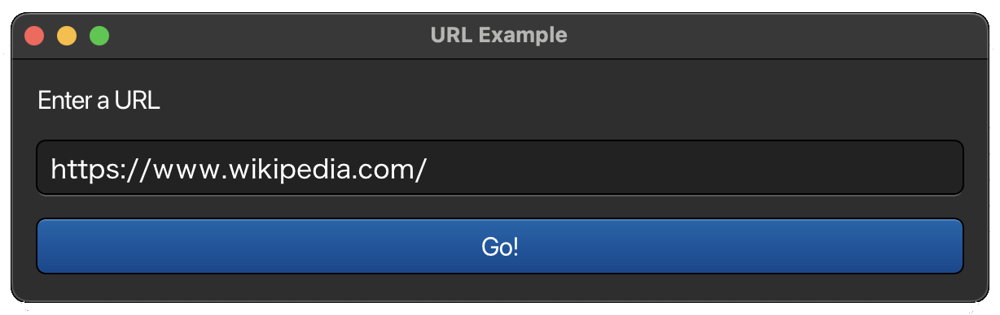
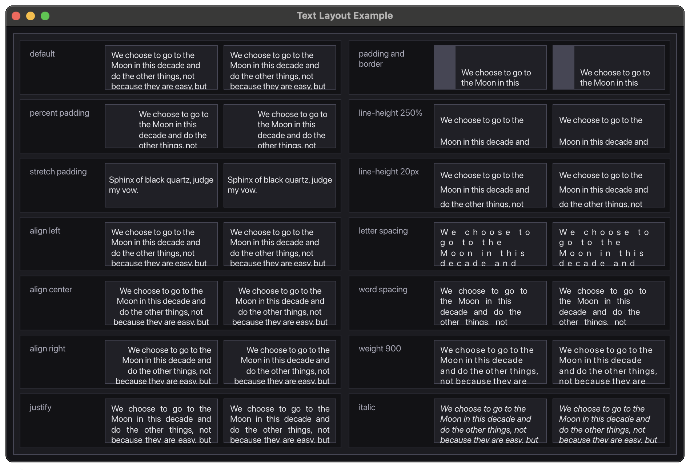
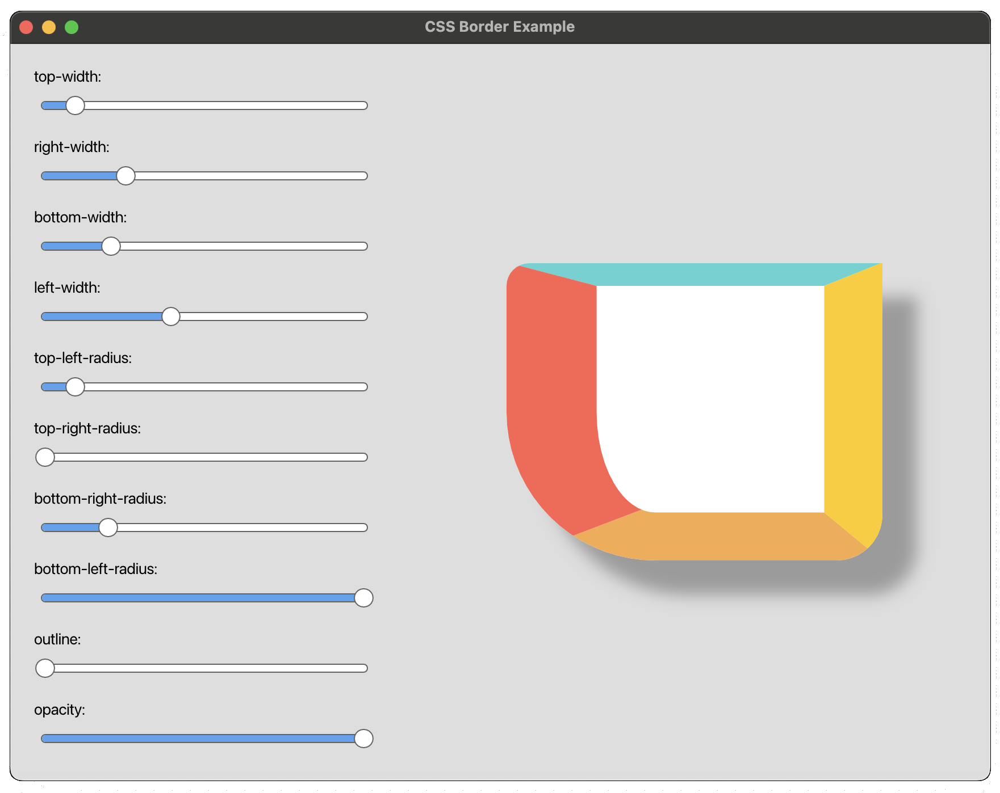

# Rosin

Rosin is a GUI library written in pure Rust with the following goals:
- Have an intuitive, idiomatic, and well-documented API.
- Prioritize correctness and reliability.
- Enable fast development iteration.
- Achieve high performance.
- Provide everything needed to build cross-platform, native desktop apps in Rust.

It's being built for use in [Sailbrush](https://ko-fi.com/sailbrush), a 2D animation and compositing program.

It can be used as a framework or a library, and the API is designed to feel like an immediate-mode toolkit. However, when possible it reuses your UI tree behind the scenes to avoid redundant work. Interfaces are styled with CSS, and it supports complex layouts. In debug mode, stylesheets and localization files are automatically reloaded when changed, and the `hot-reload` feature makes it possible to reload Rust code while your application is running.

[Rosin Quickstart](https://github.com/sailbrush/rosin-quickstart) is a repository that's pre-configured to work with the `hot-reload` feature.

The [Rosin Widget Garden](https://github.com/sailbrush/rosin-widget-garden) is a repository for contributing new widgets.

Currently, only the macOS platform integration is ready to use.

## Examples

## Planned Work

- [ ] A more extensive and robust set of included widgets.
- [ ] Windows and Linux platform integrations.
- [ ] Advanced dev tools to introspect an app at runtime.
- [ ] A method to fuzz test arbitrary UIs similar to [Fuzz Map](https://www.fuzzmap.io).

## The Name

The idea of representing a UI as a unidirectional data flow was [popularized](https://www.youtube.com/watch?v=nYkdrAPrdcw) by Facebook engineers in an architecture they called Flux. In keeping with the Rust community's penchant for giving crates metallurgically themed names, Rosin is a type of solder flux.

## Tree

A GUI can be thought of as a tree of rectangles with event handlers and visual properties. To build a UI with Rosin, you provide a function that takes your app state and constructs a tree using a simple builder API. When needed, Rosin will call your function again to get an updated version of the tree.

By making the UI a pure function of state, there is a single source of truth that determines what is displayed to the user, which makes it impossible for the UI to fall out of sync with the app state.

In order to give nodes in the tree stable identities between rebuilds, the `id!()` macro generates a unique ID at compile-time by hashing the source file name and location of its call-site.

## Reactivity

Rosin provides a reactive system using techniques learned from [Leptos](https://leptos.dev) that allows it to track when relevant variables have been modified in order to update the viewport only when needed.

The system is designed to remain consistent in the event of a panic, so the UI won't break if a background thread crashes while accessing application state.

It's also very lightweight, handling tens of millions of operations per second.

**IMPORTANT**: If a value isn't stored in a reactive `Var`, Rosin won't know to update the screen when it changes.

## Style

Rosin uses CSS files to style the interface. In debug mode, files are automatically reloaded when changed so you don't have to wait for a recompile every time you tweak your design.

Stylesheets are scoped, affecting only the nodes they're attached to and their descendants. A stylesheet in the tree will override properties of sheets lower in the tree, which allows you to attach a global theme to the root node that provides CSS variables and property overrides to every element.

The default theme uses `em` units for most sizes, so scaling the UI only requires adjusting the root node's font size.

Styles can also be changed dynamically at runtime by assigning an `on_style` callback to a node.

There's a [list of supported CSS properties](https://docs.rs/rosin/latest/rosin/css/) in the docs.

## Layout

Rosin uses the ideas introduced by [Subform](https://subformapp.com/articles/why-not-flexbox/) to provide a layout system that's easier to understand than flexbox, because it has fewer concepts applied more consistently.

The solver uses a single-pass algorithm similar to the one used by Google's [Flutter](https://youtu.be/UUfXWzp0-DU?t=164) which results in excellent performance. It lays out ~10,000 nodes in ~1.8ms on an M1 MacBook Air, which is ~2.3x faster than [Yoga](https://github.com/facebook/yoga) and [Taffy](https://github.com/DioxusLabs/taffy). It has yet to be seriously optimized.

Rosin also passes [the smooth resize test](https://raphlinus.github.io/rust/gui/2019/06/21/smooth-resize-test.html).

There's a [layout guide](https://docs.rs/rosin/latest/rosin/layout/index.html) in the docs.

## Animation

When a node in the tree has an `On::AnimationFrame` event handler, it's invoked once per display refresh. If the handler causes any visual state to change, the framework schedules a redraw and renders a new frame. If no AnimationFrame handlers are registered anywhere in the tree, the application goes idle until another event occurs.

## WGPU

Apps are given the opportunity to draw to the WGPU surface before the UI, which makes it very easy to integrate custom rendering pipelines.

## Localization

Rosin has deeply integrated localization support through [Fluent](https://projectfluent.org), and the included platform integration supports IME for [editing text](https://lord.io/text-editing-hates-you-too/) in multiple languages.

## Accessibility

It's easy to annotate a UI tree with accessibility information through [AccessKit](https://github.com/AccessKit/accesskit). The plan is for all default widgets to handle this automatically, so in many cases no additional work will be required for an application to support assistive technologies. Additionally, the accessibility tree is only constructed when the platform requests it, so there's no performance penalty when it's not being used.

## Platform Features

The included platform integration supports a wide range of features including; pen pressure, timers, clipboard access, native context menus, file menus, file dialogs, modal dialogs and more. It has everything needed to build complex desktop apps.

## Safety

All unsafe code is restricted to the platform integration, where it is necessary to interact with the operating system. The core functionality is provided by the `rosin-core` crate, which denies `unsafe` in non-test code.

## Testing

- [Source-based coverage](https://github.com/taiki-e/cargo-llvm-cov) and [Mutation testing](https://github.com/sourcefrog/cargo-mutants) are used to guide the development of the test suite.
- The test suite is run under [Miri](https://github.com/rust-lang/miri) to increase confidence in dependencies that may use unsafe code.
- [Concurrency permutation testing](https://github.com/tokio-rs/loom) is used to test all possible interleavings of actions between threads, ensuring the absence of deadlocks or panics in the reactive system.
- [Fuzz testing](https://github.com/rust-fuzz/cargo-fuzz) has been used to stress the CSS parser for over 100 hours without finding any issues.

Future tests are planned, including:

- [Property-based testing](https://github.com/proptest-rs/proptest), to verify that key invariants of the layout system hold for randomly generated layouts.
- Golden image tests, to catch regressions in the renderer.

## Performance

It's common for rendering a frame to require less than a millisecond of CPU time in release builds, with the rest of the time being spent in the GPU. Thanks to the phenomenal performance of [Vello](https://github.com/linebender/vello), it's easy to achieve hundreds of frames per second.

- The viewport only renders a frame when data that affects on-screen content has changed. When an application is idle, no CPU time or battery is wasted.
- When rendering, data is automatically reused from the previous frame, avoiding most redundant work.
- Memory allocations are reused when possible (within the limits of safe Rust) to reduce allocator traffic.
- The style system only touches nodes that are out of date, so the style pass is typically very quick, even with large trees.
- Layout is computed in a single pass, avoiding the pathological cases often encountered by other layout algorithms.
- Frequently used data structures have good data locality.
- Dependencies are kept to a minimum to reduce compile times.
- With the [standard tricks](https://github.com/johnthagen/min-sized-rust), apps can be made under 5MB.

Right now, most of the code is single-threaded and there are some opportunities to reuse even more data from previous frames, so it'll be possible to make everything even faster. However, this isn't a high priority since performance is already solid.

## Acknowledgements

This project wouldn't be possible without the work of the [Linebender](https://linebender.org) organization, and the countless other GUI projects in the Rust ecosystem that provided inspiration.

## License

Licensed under either of

  - Apache License, Version 2.0 ([LICENSE-APACHE](LICENSE-APACHE) or http://www.apache.org/licenses/LICENSE-2.0)
  - MIT license ([LICENSE-MIT](LICENSE-MIT) or http://opensource.org/licenses/MIT)

at your option.

## Contribution

Any contribution intentionally submitted for inclusion in the work by you shall be dual-licensed as above, without any additional terms or conditions.
